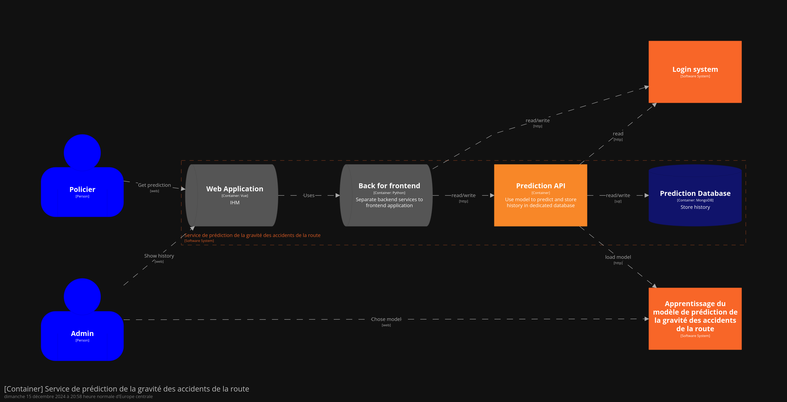

Prediction of the severity of accidents
==============================

This project allows the prediction of the severity of accidents from a prediction model trained via the sklearn library.

# Architecture

The architecture is designed using the c4 model : https://c4model.com/ and contains 3 systems :
- Login
- Service of prediction of the severity of accidents
- Training model of prediction of the severity of accidents

And 2 personas :
- Policier
- Admin

**Level 1 schema :**

# Systems

## Login system

Show [README.md Login](login/README.md) document

## Training system

Show [README.md Training](training/README.md) document

## API system

API lvl 2 schema : 

Show [README.md Login](login/README.md) document for detail of `Prediction API`.

`BFF` and `Web Application` are not implemented.

# Run locally

Each system can be run locally with `docker compose`.

# Deployment

Show [README.md deployment](flux/README.md) document

# Remained to be done

## Code base

- Implements BFF
- Implements frontend
- Refactor Prediction API to build solid domain object
- Add others unit tests to improve coverage

## Deployment
- Deploy Vault for credentials
- Deploy Kafka prod ready (with registry, Zookeeper or managed)
- Deploy lakeFS prod ready (with dedicated database or managed)
- Run load tests to set cpu, memory resources and adjust replicas number
- Use FluxCD

## Monitoring
- Implements custom metrics
- Add monitoring to all components
- Monitor FastAPI calls
- Add alerting
