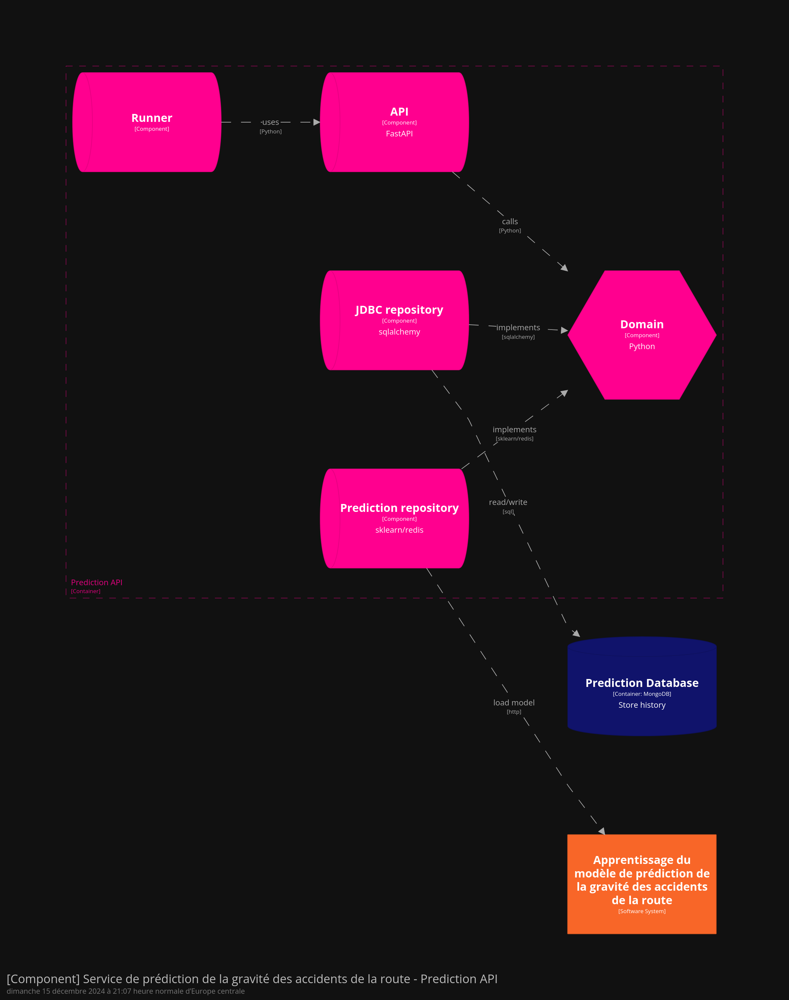

# Prediction API application

The Prediction API application allows to predict severity of accident by user input.

A history is store in dedicated mongo database and the consult is allowed only for admin.



# Build application

```bash
  docker compose build
```

# Run application in local

```bash
  docker compose up
```

# Tests

Run `1_prediction_true.http` or `2_prediction_false.http` to test prediction.
`3_get_all.http` return history for admin user.
